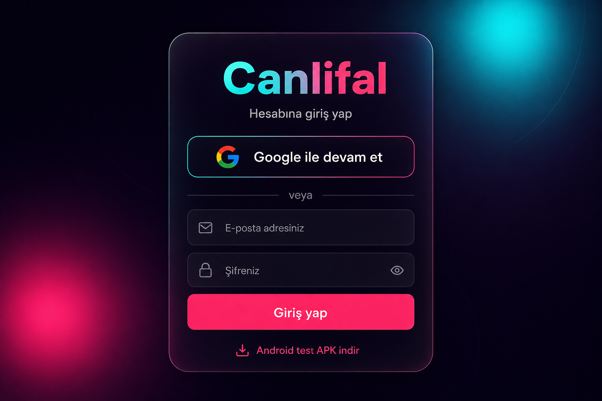

# Canlifal — Android test APK

## Görsel özet (tasarım mockup’ları)

Aşağıdaki görseller, uygulamadaki koyu tema + neon vurgu + giriş / ana sayfa / sosyal–sesli odalar düzeninin **yaklaşık** önizlemesidir (gerçek ekran görüntüsü değil, referans mockup).

| Giriş (Google + APK bağlantısı) | Ana sayfa (şeritler + hikâyeler) |
|:---:|:---:|
|  |  |

| Sosyal akış + sesli sohbet odaları (yan yana konsept) |
|:---:|
|  |

---

## Doğrudan indirme (sabit bağlantı)

`main` dalında [Build release APK](https://github.com/mesutbyrm/Cursor-Flutter-/actions/workflows/build-apk.yml) iş akışı **en az bir kez başarıyla bittikten** sonra aşağıdaki bağlantı her zaman son `main` derlemesindeki APK’yı verir:

**[canlifal-mobile-release.apk (apk-latest)](https://github.com/mesutbyrm/Cursor-Flutter-/releases/download/apk-latest/canlifal-mobile-release.apk)**

> Henüz 404 alıyorsanız: GitHub → **Actions** → **Build release APK** → **Run workflow** → dal olarak **`main`** seçin → işlem bitsin. İş akışı otomatik olarak **`apk-latest`** adlı sürümü oluşturur veya günceller.

`releases/latest/download/...` kullanmıyoruz; GitHub “latest” etiketini semver’a göre sıraladığı için `apk-latest` gibi **sabit etiket + dosya adı** daha güvenilir.

## Chrome Android: “İndiriliyor…” %100 / MB tamam ama bitmiyor

Bu **dosya bozuk değil**; çoğu zaman Chrome’un APK’yı güvenlik taramasına sokması veya geçici dosyayı (`.crdownload`) nihai `canlifal-mobile-release.apk` adına taşırken arayüzün takılı kalmasıdır. Birkaç dakika bekleyin; **İndirilenler** uygulamasında dosya yine de oluşmuş olabilir.

**Ne işe yarar:**

1. **Sürüm sayfasından indirin** (genelde daha sorunsuz):  
   **[apk-latest sürüm sayfası](https://github.com/mesutbyrm/Cursor-Flutter-/releases/tag/apk-latest)** → **Assets** → `canlifal-mobile-release.apk` üzerine uzun basıp **Bağlantıyı indir** veya dokunarak indirin.
2. **Başka tarayıcı:** Firefox, Samsung Internet veya Edge ile aynı doğrudan bağlantıyı deneyin.
3. **Bilgisayardan indirip** USB veya Drive ile telefona atın.
4. İndirmeyi **iptal edip** Wi‑Fi / mobil veri değiştirerek yeniden deneyin; gerekirse Chrome’da **İndirilenler** önbelleğini temizleyin.

## Sürüm etiketi (v1.0.0 gibi)

```bash
git tag v1.0.0 && git push origin v1.0.0
```

İndirme örneği:  
`https://github.com/mesutbyrm/Cursor-Flutter-/releases/download/v1.0.0/canlifal-mobile-release.apk`

## GitHub Actions (ZIP artifact)

1. **[Build release APK](https://github.com/mesutbyrm/Cursor-Flutter-/actions/workflows/build-apk.yml)**  
2. **Run workflow** → istediğiniz dal  
3. **Artifacts** → `canlifal-social-release-apk` → ZIP → `canlifal-mobile-release.apk`

## Yerelde derle

```bash
cd mobile
flutter pub get
flutter build apk --release
```

Çıktı: `mobile/build/app/outputs/flutter-apk/app-release.apk`

```bash
flutter build apk --release --dart-define=API_BASE_URL=https://canlifal.com
```

## API

`mobile/lib/core/config/env.dart`, uçlar: `mobile/lib/core/network/api_endpoints.dart`.
