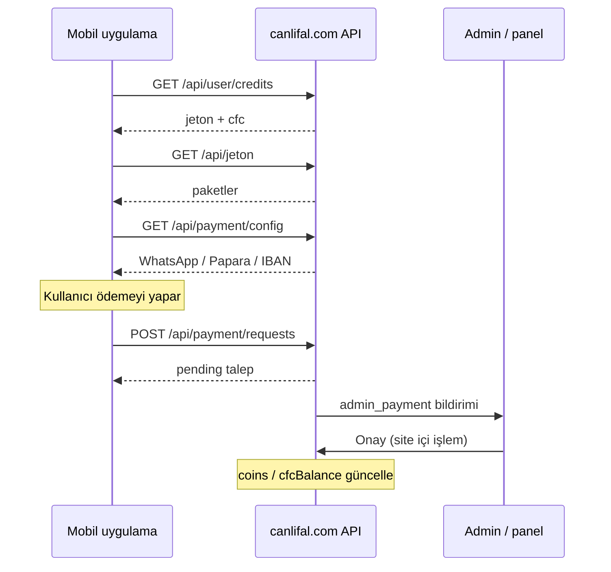

# CFC (CanlıFal Coin) ÖDEME SİSTEMİ API DOKÜMANTASYONU

Bu belge **canlifal.com** üretim sitesi ve **Flutter mobil uygulama** için ortak cüzdan / ödeme API sözleşmesini tanımlar. Referans uygulama: bu repodaki `api/src/routes/wallet.ts`.

---

## 1. Kavramlar

| Birim | Açıklama | Kullanım |
|-------|----------|----------|
| **Jeton** | Ana uygulama parası (`User.coins`) | Hediye, canlı yayın, ses odası, genel harcama |
| **CFC** | CanlıFal Coin (`User.cfcBalance`) | Premium içerik, özel özellikler |
| **Ödeme talebi** | Kullanıcının manuel ödeme bildirimi | WhatsApp / Papara / Havale sonrası admin onayı |

Mobil uygulama her iki bakiyeyi birlikte gösterir. **Jeton yükleme** akışı ödeme talebi oluşturur (`coins` alanı jeton miktarıdır). CFC artışı bu talepten otomatik yapılmaz; admin onayı sonrası ayrı işlenir.

---

## 2. Kimlik doğrulama

**Üretim (canlifal.com):** NextAuth oturum çerezi (`credentials` / Google). İsteklerde oturum çerezi gönderilir; sunucu `req.userId` çözer.

**Yerel API / JWT:** `Authorization: Bearer <access_token>`.

| Uç | Oturum |
|----|--------|
| `GET /api/user/credits` | Opsiyonel (misafir → sıfır bakiye) |
| `GET /api/jeton`, `GET /api/payment/config` | Gerekmez |
| `POST /api/payment/requests` | Opsiyonel (misafir talep açabilir) |
| `GET /api/notifications` | Opsiyonel |
| `GET /api/admin/*` | Zorunlu + staff rolü |

### Staff rolleri

`admin`, `yonetici`, `moderator`, `destek`, `yardim` — küçük harf, Türkçe.

---

## 3. Yanıt zarfı (envelope)

Başarılı (çoğu uç):

```json
{
  "success": true,
  "data": { }
}
```

Hata:

```json
{
  "success": false,
  "error": {
    "code": "VALIDATION_ERROR",
    "message": "Geçersiz ödeme yöntemi"
  }
}
```

Bazı liste uçları (`/api/jeton`, `/api/notifications`) doğrudan `{ "packages": [...] }` veya `{ "items": [...] }` da dönebilir; mobil istemci her iki biçimi okur.

---

## 4. Bakiye uçları

### `GET /api/user/credits`

Kullanıcının **jeton + CFC + rol** bilgisi.

**Yanıt `data`:**

```json
{
  "credits": 500,
  "coins": 500,
  "jeton": 500,
  "cfc": 120,
  "cfcBalance": 120,
  "balance": 500,
  "role": "user"
}
```

| Alan | Tip | Açıklama |
|------|-----|----------|
| `jeton`, `coins`, `credits`, `balance` | number | Aynı değer (jeton bakiyesi) |
| `cfc`, `cfcBalance` | number | CFC bakiyesi |
| `role` | string | Kullanıcı rolü |

Misafir: tüm sayısal alanlar `0`, `role` yok.

### `GET /api/wallet` (alternatif)

```json
{
  "balance": 500,
  "jeton": 500,
  "cfc": 120,
  "role": "user"
}
```

---

## 5. Jeton paketleri

### `GET /api/jeton`

Mağaza paket listesi (oturum gerekmez).

**Örnek yanıt:**

```json
{
  "packages": [
    {
      "id": "p100",
      "title": "100 Jeton",
      "coins": 100,
      "priceTry": 29.9,
      "badge": "Popüler"
    }
  ],
  "items": [ ],
  "data": [ ]
}
```

| Alan | Tip | Zorunlu |
|------|-----|---------|
| `id` | string | Evet |
| `title` | string | Evet |
| `coins` | number | Evet |
| `priceTry` | number | Hayır |
| `badge` | string | Hayır |

---

## 6. Ödeme yapılandırması

### `GET /api/payment/config`

Sitede tanımlı ödeme kanalları. İlk istekte kayıt yoksa varsayılan oluşturulabilir (yerel API).

**Yanıt `data`:**

```json
{
  "id": "default",
  "whatsappNumber": "905551234567",
  "paparaAddress": "canlifal@papara.com",
  "bankIban": "TR00 0000 0000 0000 0000 0000 00",
  "bankName": "Ziraat Bankası",
  "accountHolder": "CanlıFal",
  "updatedAt": "2026-05-21T12:00:00.000Z"
}
```

Mobil istemci alternatif anahtarlar: `whatsapp`, `papara`, `iban`, `holder`.

**canlifal.com ortam değişkenleri (örnek):**

| Değişken | Açıklama |
|----------|----------|
| `PAYMENT_WHATSAPP` | WhatsApp numarası (ülke kodu ile) |
| `PAYMENT_PAPARA` | Papara no / adres |
| `PAYMENT_IBAN` | Havale IBAN |
| `PAYMENT_BANK` | Banka adı |
| `PAYMENT_HOLDER` | Hesap sahibi |

---

## 7. Ödeme talebi

### `POST /api/payment/requests`

Kullanıcı ödemeyi yaptıktan sonra talep açar. **Admin** ve **site bildirim paneli** bilgilendirilir.

**İstek gövdesi (JSON):**

```json
{
  "method": "whatsapp",
  "packageId": "p500",
  "packageTitle": "500 Jeton",
  "coins": 500,
  "amountTry": 129.9,
  "userName": "Ahmet",
  "note": "Dekont yüklendi"
}
```

| Alan | Tip | Zorunlu | Açıklama |
|------|-----|---------|----------|
| `method` | string | Evet | `whatsapp` \| `papara` \| `havale` |
| `packageId` | string | Hayır | Paket kimliği |
| `packageTitle` | string | Hayır | Görünen başlık |
| `coins` | number | Hayır | Yüklenecek jeton (varsayılan 0) |
| `amountTry` | number | Hayır | TL tutarı |
| `userName` | string | Hayır | Bildirimde görünen ad |
| `note` | string | Hayır | Max 500 karakter |

**Başarı `201` — `data` (PaymentRequest):**

```json
{
  "id": "clx…",
  "userId": "user_abc",
  "userName": "Ahmet",
  "method": "papara",
  "packageId": "p500",
  "packageTitle": "500 Jeton",
  "amountTry": 129.9,
  "coins": 500,
  "status": "pending",
  "note": null,
  "createdAt": "2026-05-21T14:00:00.000Z",
  "updatedAt": "2026-05-21T14:00:00.000Z"
}
```

### Bildirim akışı (otomatik)

1. **Kullanıcıya:** `type: payment`, `targetPath: /jeton-store`, `targetId: <talep id>`
2. **Her staff kullanıcıya:** `type: admin_payment`, `targetPath: /admin/payments`, `targetId: <talep id>`

### `status` değerleri (öneri)

| Değer | Anlam |
|-------|--------|
| `pending` | Bekliyor (varsayılan) |
| `approved` | Onaylandı, jeton/CFC yüklendi |
| `rejected` | Reddedildi |

Onay sonrası sunucuda: `User.coins += coins` ve/veya `User.cfcBalance += …` (iş kuralınıza göre).

---

## 8. Bildirimler

### `GET /api/notifications`

**Yanıt:**

```json
{
  "items": [
    {
      "id": "…",
      "title": "Ödeme talebi alındı",
      "body": "Ahmet — Papara · 500 Jeton",
      "message": "…",
      "type": "payment",
      "targetPath": "/jeton-store",
      "targetId": "clx…",
      "actionUrl": "/jeton-store",
      "read": false,
      "isRead": false,
      "createdAt": "2026-05-21T14:00:00.000Z"
    }
  ]
}
```

Mobil: `targetPath` veya `type` ile yönlendirme (`notification_action.dart`).

### `PATCH /api/notifications/:id/read`

```json
{ "success": true, "data": { "read": true } }
```

### Bildirim `type` değerleri

| type | Mobil yönlendirme |
|------|-------------------|
| `payment`, `jeton` | `/jeton-store` |
| `admin_payment`, `admin` | `/admin` |
| `gift`, `live` | `/live` |
| `message`, `chat` | `/messages` |
| `social` | `/social` |

---

## 9. Admin uçları (staff)

### `GET /api/admin/payment-requests`

**Query:** `?status=pending` (opsiyonel)

**Yanıt:**

```json
{
  "success": true,
  "data": {
    "requests": [ { /* PaymentRequest */ } ]
  }
}
```

### `GET /api/admin/notifications`

Son 100 bildirim (panel senkronu).

---

## 10. Veritabanı (Prisma referansı)

```prisma
model User {
  coins       Int    @default(500)   // Jeton
  cfcBalance  Int    @default(0)     // CFC
  role        String @default("user")
}

model PaymentConfig { … }
model PaymentRequest { … }
model AppNotification { … }
```

---

## 11. Mobil uygulama eşlemesi

| Özellik | Dosya / uç |
|---------|------------|
| Çift bakiye UI | `DualBalanceChips`, `GET /api/user/credits` |
| Jeton mağazası | `JetonPurchasePage`, `GET /api/jeton` |
| Ödeme checkout | `JetonNativeCheckout`, `POST /api/payment/requests` |
| Bildirim tıklama | `navigateFromNotification`, `GET /api/notifications` |
| Admin panel | `AdminHubPage`, `GET /api/admin/payment-requests` |

Varsayılan API tabanı: `https://canlifal.com` (`Env.apiBaseUrl`).

---

## 12. canlifal.com kontrol listesi

- [ ] `User.cfcBalance` + `User.role` alanları
- [ ] `GET /api/user/credits` → jeton + cfc + role
- [ ] `GET /api/payment/config` → WhatsApp, Papara, IBAN
- [ ] `POST /api/payment/requests` → kayıt + bildirimler
- [ ] `GET /api/notifications` + `PATCH …/read`
- [ ] Staff için `GET /api/admin/payment-requests`
- [ ] Admin panelinde talep onayında jeton/CFC yükleme

Kısa kurulum özeti: [CANLIFAL_COM_KURULUM.md](./CANLIFAL_COM_KURULUM.md)

---

## 13. Örnek akış (sıra)



---

*Sürüm: mobil 1.0.26+28 · Son güncelleme: 2026-05-21*
