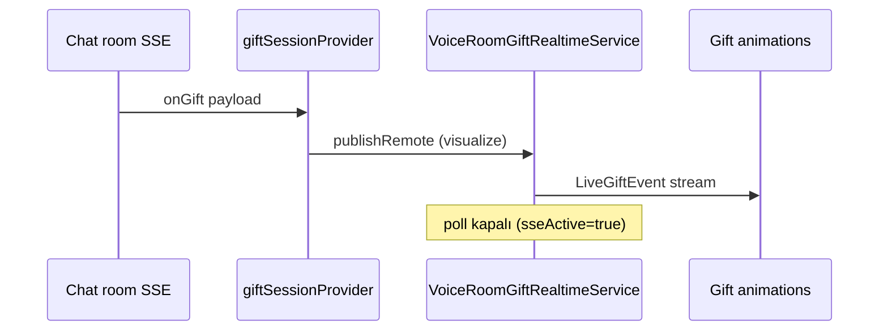

# Hediye gerçek zamanlı — SSE vs Socket.IO (Flutter referansı)

**Tarih:** 2026-08-18  
**Durum:** Flutter davranışı belgelendi; backend canonical onayı bekleniyor (B3).

---

## Özet (sesli oda)

| Kanal | Öncelik | Ne zaman aktif | Ne yapar |
|-------|---------|----------------|----------|
| **SSE** `GET /api/chat/rooms/{id}/stream` | **1 (birincil)** | Oda açık + SSE bağlı | `type: gift` → animasyon + jeton |
| **REST poll** `fetchRoomGiftEvents` | **2 (yedek)** | SSE yok + socket tercih edilmiyor | 6 sn aralıkla yeni hediyeler |
| **Socket.IO** | **3 (opsiyonel)** | Kodda yedek; SSE bağlanınca `setSocketPreferred(false)` | Canlı yayında `/live` namespace ayrı |

**Kural:** SSE bağlıyken REST poll **kapalı** (`setSseActive(true)` → `stop()`).

---

## Akış diyagramı (sesli oda)

---

## Kod referansları

| Dosya | Rol |
|-------|-----|
| `chat_room_providers_sse.dart` | SSE `onGift` → `dispatchGiftSsePayloadRef` |
| `gift_sse_dispatch.dart` | Motor kuralları: skip / queueSync / visualize |
| `voice_room_gift_realtime_service.dart` | SSE aktifken poll durdur; dedupe |
| `gift_session_controller.dart` | Tek oturum state (host/guest aynı) |

---

## SSE payload işleme

1. `GiftPayloadUtil.unwrap` — `data` / `payload` sarmalayıcıları açar
2. `routeGiftSsePayload` → `GiftEngineSseAction`:
   - `skip` — dedupe / motor atlama
   - `queueSync` — kuyruk senkronu (çoklu hediye)
   - `finished` — animasyon bitti
   - `visualize` / `legacyVisualize` — `publishRemote` + UI

---

## Canlı yayın (fark)

| Alan | Sesli oda | Canlı yayın |
|------|-----------|-------------|
| Stream | `/api/chat/rooms/{id}/stream` | Video stream SSE + Socket `/live` |
| Provider | `voiceRoomGiftRealtimeProvider` | `liveGiftRealtimeProvider` |
| Socket | SSE birincil; socket yedek kodu var | `live_namespace_socket_service.dart` PK/skor |

---

## Backend'den istenen (B3 kapanışı)

1. Resmi canonical: sesli oda hediyeleri **yalnızca SSE** mi, yoksa Socket.IO da zorunlu mu?
2. `gift` SSE örnek payload (jeton, combo, engine v2 alanları)
3. Socket namespace/room join sözleşmesi (varsa) — mobilde şu an SSE öncelikli

**İlgili:** `docs/SSE_EVENTS_FLUTTER_PARSED.md`, `docs/BACKEND_REQUIREMENTS_TO_REQUEST.md`
