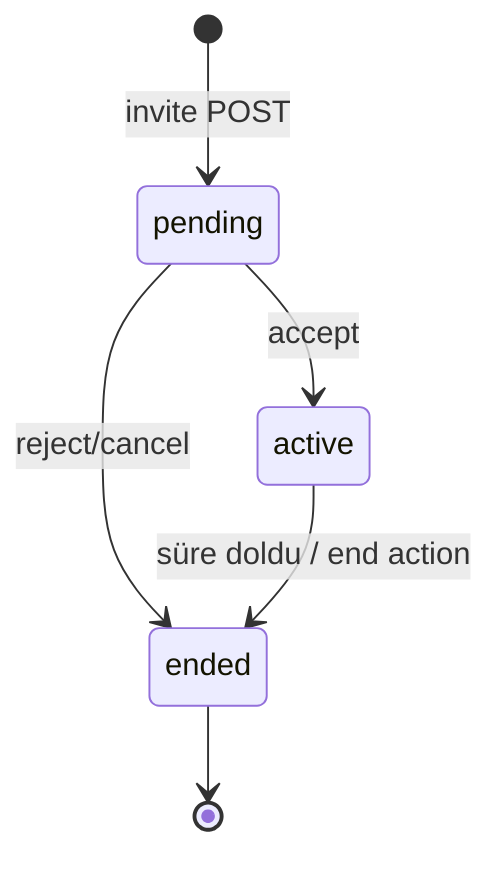

# PK durum makinesi — Flutter referansı (FAZ 0 / B4)

**Tarih:** 2026-08-18  
**Kaynak:** Mevcut Flutter kodu — resmi backend şeması gelene kadar geçici referans.

---

## İki katman

| Katman | Tip | Kullanım |
|--------|-----|----------|
| **UI state** | `PkBattleState` + `PkBattlePhase` | Yerel sayaç, animasyon, oran çubuğu |
| **Sunucu state** | `PkBattleRemote` | REST + SSE ile senkron |

`serverAuthoritative: true` iken UI skorları sunucudan gelir.

---

## Sunucu durumları (`PkBattleRemote.status`)

| status | Anlam | Flutter |
|--------|-------|---------|
| `pending` | Davet bekliyor | `isPending` |
| `accepted`, `accepted_invite` | Kabul edildi → aktif sayılır | `isActive` (normalize) |
| `active` | Savaş sürüyor | `isActive` |
| `ended`, `completed` | Bitti | `isEnded` |
| `rejected`, `cancelled`, `canceled` | İptal / red | `isEnded` |

**Kimlik alanları:** `id`, `pkBattleId`, `battleId`, `inviteId` — `effectiveId` respond path için kullanılır.

---

## UI fazları (`PkBattlePhase`)

```
ready → active → finished
```

| Faz | UI |
|-----|-----|
| `ready` | Davet / hazırlık |
| `active` | Sayaç, skor barı, hediye patlaması |
| `finished` | Kazanan, sonuç ekranı |

---

## API uçları (sesli oda)

Tüm oda PK aksiyonları tek uca gider (404/405’te alternatif oda anahtarı):

```
POST /api/chat/rooms/{roomId}/pk
GET  /api/chat/rooms/{roomId}/pk
```

Gövde örnekleri (`pk_battle_remote_datasource.dart`):

| action | Açıklama |
|--------|----------|
| `invite` | PK daveti |
| `accept` / `reject` | Yanıt |
| `end` | Erken bitir |

Canlı yayın PK: `POST /api/video-streams/pk` (`action: create`, `streamId`, `targetStreamId`).

---

## SSE olayları

Oda SSE stream’inde PK ile ilişkili tipler (`chat_room_sse_event.dart`):

- `pk`, `pk_battle`, `pk_score`, `pk_invite`, `pk_ended`, `gift_ranking_updated`

İşleme: `pkBattleRemoteProvider.ingestSseBattle` (`chat_room_providers_sse.dart`, `voice_gift_pk_sync.dart`).

---

## Durum geçişi (özet)



---

## Skor alanları

| Alan | Alias |
|------|-------|
| `challengerScore` | `leftScore` |
| `opponentScore` | `rightScore` |
| `secondsLeft` | — |
| `targetScore` | hedef jeton (varsayılan 150000) |
| `recentGifts` | son hediye listesi |

---

## Backend'den istenen

1. Resmi PK state diyagramı (web ile birebir status listesi)
2. SSE `pk_*` örnek JSON (oda + canlı yayın)
3. `/api/pk/battles` vs `/api/chat/rooms/{id}/pk` — hangisi canonical?

**İlgili:** `docs/SSE_EVENTS_FLUTTER_PARSED.md`, `mobile/lib/features/voice_hub/data/datasources/pk_battle_remote_datasource.dart`
