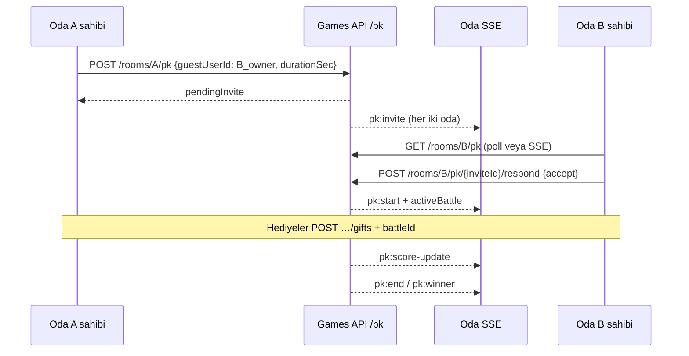

# Sesli Oda PK — Web vs Flutter Parite Analizi

**Tarih:** 15 Temmuz 2026  
**Üretim:** `https://canlifal.com` (oda, SSE, hediye) + `https://canlifalapi.abacusai.app` (sesli oda PK REST)

---

## 1. Mimari Özet

Canlifal'da **üç ayrı PK katmanı** vardır; karıştırılmamalıdır:

| Katman | Kapsam | REST tabanı | Gerçek zamanlı |
|--------|--------|-------------|----------------|
| **Sesli oda PK** | Voice chat odaları 1v1 | `GET/POST /api/chat/rooms/{roomId}/pk` → **games backend** | Oda SSE `type: pk` + Socket.IO (web) |
| **Canlı yayın PK (legacy)** | Video stream 1v1 | `GET/POST /api/video-streams/{id}/pk-battle` | Yayın SSE + Socket.IO |
| **Birleşik PK (Faz 1–3)** | Live stream guest/team, liderlik | `GET/POST /api/pk/*` → games backend | `GET /api/pk/{id}/stream` SSE |

Bu doküman **sesli oda PK** odaklıdır. Birleşik PK için: [`PK_SYSTEM_FLUTTER_INTEGRATION.md`](./PK_SYSTEM_FLUTTER_INTEGRATION.md).

### Üretim doğrulaması (curl, oturumsuz)

| Uç | Host | HTTP | Yanıt |
|----|------|------|-------|
| `GET …/chat/rooms/{id}/pk` | canlifal.com | 200 | `null` (stub — **kullanılmamalı**) |
| `GET …/chat/rooms/{id}/pk` | canlifalapi.abacusai.app | 200 | `{"roomId":"…","activeBattle":null,"pendingInvite":null}` |
| `GET …/chat/rooms/{id}/pk-battle` | her iki host | **404** | Eski yol deploy edilmemiş |
| `POST …/chat/rooms/{id}/pk` | games | 401 | JWT zorunlu |

Flutter `ApiBackendRouter` sesli oda `/pk` alt yolunu otomatik games backend'e yönlendirir (`api_backend_router.dart`).

---

## 2. Sesli Oda PK — API Sözleşmesi (üretim / games)

### 2.1 Endpoint'ler

| İşlem | Metod | Path | Auth | Body |
|-------|-------|------|------|------|
| Durum sorgula | GET | `/api/chat/rooms/{roomId}/pk` | Opsiyonel | — |
| Davet gönder | POST | `/api/chat/rooms/{roomId}/pk` | JWT | `{ guestUserId, durationSec }` |
| Kabul / red | POST | `/api/chat/rooms/{roomId}/pk/{inviteId}/respond` | JWT | `{ action: "accept" \| "reject" }` |
| Erken bitir | POST | `/api/chat/rooms/{roomId}/pk/{battleId}/end` | JWT | — |
| Hediye (PK skoru) | POST | `/api/chat/rooms/{roomId}/gifts` | JWT | `{ giftTypeId, quantity, streamId: roomId, battleId? }` |

`roomId`: cuid veya slug (Flutter her ikisini de dener).

### 2.2 GET yanıt şekli

```json
{
  "roomId": "cmokyb9o9007iod09gi6pb1tb",
  "activeBattle": null,
  "pendingInvite": null
}
```

Aktif savaş veya bekleyen davet varken ilgili alan dolu nesne döner. Flutter `PkBattleRemote.fromJson` ile parse eder.

### 2.3 POST davet yanıtı (beklenen)

Bekleyen davet: `{ inviteId, status: "pending", voiceRoomId, opponentVoiceRoomId, opponentId, durationSeconds, … }`

Kabul sonrası: `{ status: "accepted", battle: { … } }`

### 2.4 Yetkilendirme kuralları (iş mantığı)

| Kural | Açıklama |
|-------|----------|
| Davet gönderme | Oda sahibi veya yetkili kullanıcı; `guestUserId` = rakip oda sahibinin `userId` |
| Davet alma | `opponentId` / `opponentVoiceRoomId` hedef odayı işaret eder |
| Kabul / red | Hedef oda sahibi (`respond` path'inde hedef odanın `roomId`) |
| Bitir | Taraflardan biri veya süre dolunca |
| Hediye skoru | PK aktifken `battleId` gönderilmeli |

---

## 3. Gerçek Zamanlı Olaylar

### 3.1 Oda SSE (birincil — Flutter)

**Bağlantı:** `GET /api/chat/rooms/{roomId}/stream` (JWT)  
**Host:** canlifal.com

| `type` | Açıklama |
|--------|----------|
| `pk` | PK durum güncellemesi (skor, süre, durum) |

Payload örneği:

```json
{
  "type": "pk",
  "event": "pk:score-update",
  "battle": { "id": "…", "status": "active", "challengerScore": 1200, … },
  "pk": { … }
}
```

Flutter: `chat_room_sse_service.dart` → `onPk` → `pkBattleRemoteProvider.ingestSseBattle`.

### 3.2 Socket.IO (web — ikincil)

**Host:** canlifal.com (`Env.siteOrigin`)  
**Join:** `joinRoom { roomId }`, `joinPkBattle { battleId }`

| Olay | Açıklama |
|------|----------|
| `pk:invite` | Yeni davet |
| `pk:accept` / `pk:reject` | Yanıt |
| `pk:start` | Savaş başladı |
| `pk:score-update` | Skor |
| `pk:gift` | Hediye |
| `pk:end` / `pk:winner` | Bitiş |
| `pkBattle` / `pkBattleUpdated` | Legacy alias |

Kaynak: `docs/nextjs/pk/SOCKET_EVENTS.md`, `api/src/socket/giftHub.ts`.

Flutter: `pk_battle_socket_service.dart` — oda dışı / SSE yedek kanal.

### 3.3 Oda dışı davet keşfi

`VoicePkInviteListener`: sahip olunan odalar için **3 sn poll** `GET /pk` (games backend).

---

## 4. İş Akışı



---

## 5. Web deploy paketi vs üretim

`docs/nextjs/pk/` paketi **eski** `pk-battle` + `{ action, opponentRoomId }` sözleşmesini tanımlar. Üretimde bu yol **404**. Web arayüzü muhtemelen güncel `/pk` + `guestUserId` kullanıyor; **doğrulama için web HAR örneği gerekli** (aşağıda).

---

## 6. Flutter Uygulama Durumu

### 6.1 Uygulanan (tam)

| Özellik | Dosya |
|---------|-------|
| REST `/pk` davet/kabul/red/bitir | `pk_battle_remote_datasource.dart` |
| Games backend yönlendirme | `api_backend_router.dart` |
| Oda SSE `pk` olayı | `chat_room_sse_service.dart`, `chat_room_providers.dart` |
| Global davet dinleyici (poll) | `voice_pk_invite_listener.dart` |
| PK savaş UI | `voice_pk_battle_page.dart` |
| Hediye + `battleId` | `chat_room_gifts_remote_datasource.dart` |
| Rakip oda filtresi (`ownerId`) | `pk_opponent_room_filter.dart` |
| Oda listesinde `ownerId` parse | `live_remote_datasource.dart` |

### 6.2 Düzeltilen (bu PR)

| Sorun | Düzeltme |
|-------|----------|
| Boş GET `{activeBattle:null,pendingInvite:null}` sahte `pending` battle üretiyordu | `_parseBattle` null döner |
| PK geçmişi `/api/pk/history` (404) | `/api/pk/me/history` + yedek |
| Socket.IO PK bağlantısı no-op | `pk_battle_remote_provider` socket yeniden etkin |
| Kılavuzda sesli oda PK yok | `FLUTTER_ENTegrasyon_KILAVUZU.md` §9.3 güncellendi |

### 6.3 Açık / doğrulama gereken

| Konu | Durum | İhtiyaç |
|------|-------|---------|
| Web'in tam POST body formatı | Flutter `guestUserId` kullanıyor; CHANGELOG'da `targetRoomId` da geçiyor | Web HAR veya backend örneği |
| `pk-battle` fallback | Üretimde 404 — eklenmedi | Gerek yok |
| Birleşik `/api/pk/*` sesli odada | Ayrı stack; sesli oda legacy `/pk` | Bilinçli ayrım |
| PK geçmişi sesli oda tipi filtresi | `pkMeHistory` tüm PK türlerini dönebilir | Backend `battleType` query desteği? |
| Çoklu oda sahibi poll state | Singleton provider; listener return value kullanıyor | İleride per-room provider |

---

## 7. Backend'den İstenen Örnekler

Aşağıdakiler olmadan POST body ve SSE payload için %100 emin olunamaz:

1. **Web HAR:** Sesli odada PK daveti → kabul → hediye → bitiş (Network tab)
2. **Örnek SSE `pk` event JSON** (skor güncellemesi ve davet)
3. **`POST /pk` tam başarılı yanıt** (davet + kabul sonrası)
4. **`GET /api/pk/me/history`** örnek yanıt (sesli oda kayıtları dahil mi?)

---

## 8. Test

```bash
# Backend yönlendirme
cd mobile && flutter test test/core/network/api_backend_router_test.dart

# PK parse + rakip filtre
cd mobile && flutter test test/features/voice_hub/pk_opponent_room_filter_test.dart
cd mobile && flutter test test/features/voice_hub/pk_battle_parse_test.dart

# Üretim smoke (oturumsuz)
bash scripts/verify-pk-endpoints.sh
```
