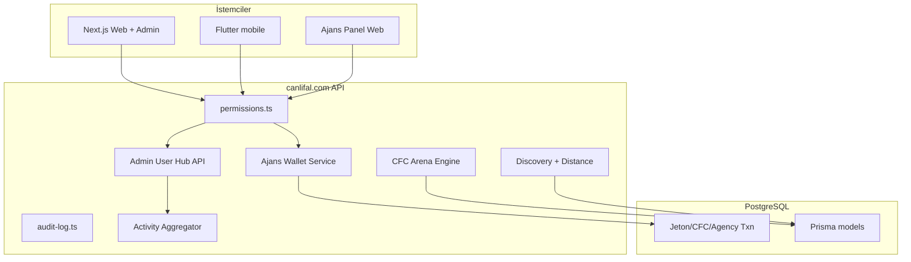

# Canlifal — Profesyonel Sosyal Platform Dönüşüm Planı

> **Tarih:** 2026-09-15 · **Kaynaklar:** `backend-reference/canlifal_flutter_paketi/` (Prisma 149 model, 384+ API), `docs/FLUTTER_ENTegrasyon_KILAVUZU.md`, `docs/ADMIN_USER_FULL_CONTROL.md`, `backend-docs/abacus-current/priority2/CANLIFAL_AGENCY.md`, bu repo `mobile/` + `api/` mirror.

## 0. Kritik sınır

| Katman | Bu repo | Üretim |
|--------|---------|--------|
| Next.js App Router + Prisma | Referans (`backend-reference/…`) | **canlifal.com** |
| Flutter mobil | **Tam kaynak** `mobile/` | APK |
| Express mirror | `api/` (kısmi) | Kullanılmaz |

**Tek gerçek kaynak:** üretim backend. Web admin, ajans paneli (web), RBAC, ledger ve activity log **sunucuda** implement edilir; Flutter/Web yalnızca aynı API ve permission bayraklarını tüketir (§59).

**Mevcut çalışan sistemleri bozmama:** Yeni tablolar yalnızca migration ile; jeton/CFC/agency bakiye **mevcut transaction/ledger** modellerine ek satır; duplicate cüzdan yok.

---

## 1. Mevcut sistem analizi (özet)

### 1.1 Kimlik ve kullanıcı

- Auth: JWT mobil (`/api/auth/mobile-login`, `mobile-refresh`, `/api/me`); `sub` ≠ iş anahtarı (`gcid` / `realCid`).
- Profil, takip, arkadaşlık, ziyaretçiler — mobil feature modülleri + kılavuz §9.

### 1.2 Ekonomi

- Jeton + CFC; admin `PATCH /api/admin/users/credits`, finance feed.
- `PaymentAuditLog`, voice room finance audit; agency tarafında referans şemada **`AgencyWallet` + `AgencyWalletTransaction`** (immutable ledger, idempotencyKey).

### 1.3 Sesli oda / canlı yayın / PK

- SSE odalar; Agora/LiveKit token uçları; PK birleşik sheet (mobil 1.0.505+).
- Admin: voice-rooms / live-streams sayfaları (mobil).

### 1.4 Canlı falcı

- `POST /api/admin/live-tellers`, approve, permissions PUT; mobil komuta merkezi falcı sheet.

### 1.5 Üyelik / VIP

- `GET /api/me/membership` capability matrisi (mobil 1.0.512+); admin membership management.

### 1.6 Ajans (kısmi)

- **Mobil:** `/api/agency/my`, members, earnings, tasks, leaderboard, invite.
- **Referans şema:** Agency, AgencyUser, AgencyEarning, AgencyTask, AgencyPenalty, AgencyLeaveRequest, **AgencyWallet**, **AgencyCommissionRule**, **AgencyBonusRule**.
- **Doküman:** `CANLIFAL_AGENCY.md`.

### 1.7 Sosyal keşif — Tanış & Kaynaş

- `GET /api/social/discovery`, actions, profile, location; mobil `tanis_kaynas_page.dart`, swipe deck, filtreler.
- Mesafe: istemci bandına geçiş (`DistanceBand`); sunucunun `distanceBand` / yuvarlanmış km göndermesi beklenir.

### 1.8 Yarışma — CFC Arena

- Referans API: `GET/POST /api/admin/cfc-arena`, `GET /api/cfc-arena`, `POST /api/cfc-arena/join`.
- Ödül tasarımı: puan, rozet, unvan (§21 — para/jeton ödülü varsayılan değil).

### 1.9 Admin kullanıcı merkezi (mobil — Faz 1–3 uygulandı)

- Rota: `/admin/users/{userId}` — 6 sekme + **bu sprint:** VIP, Ajans, Mod., Rapor + hızlı işlem şeridi.
- `AdminUserHubLauncher` — staff uzun basış → aynı merkez (keşif kartı vb.).
- Doküman: `docs/ADMIN_USER_FULL_CONTROL.md`.

### 1.10 RBAC / audit (referans)

- `kaynak/lib/permissions.ts`, `audit-log.ts`, Prisma `AuditLog`, `Role`, `Permission`, user overrides.
- Admin audit: `GET /api/admin/audit-logs`.

### 1.11 Eksik / PARTIAL (üretim probe gerekir)

- `GET /api/admin/users/{id}/overview|activity|earnings|spending|agency|moderation|reports` — mobil probe eklendi; 404 toleranslı.
- Ajans `GET /api/agency/wallet`, transfer, başvuru skoru, canlı presence.
- Merkezi activity timeline (oda/yayın/fal birleşik).
- Web admin 360° modal (tek component) — **üretim web repo**.

---

## 2. Hedef mimari (config + permission driven)

**İlkeler:** Lazy load + pagination (§49); kritik işlemde onay + neden + idempotencyKey; konumda yalnızca bant (§48).

---

## 3. Fazlı uygulama (risk sırası)

| Faz | İçerik | Repo |
|-----|--------|------|
| **P0** | RBAC + audit tüm admin POST’larda; jeton/CFC idempotent | Üretim |
| **P1** | Admin User Hub API paketi (`/overview`, `/activity`, …) | Üretim + mobil probe → native |
| **P2** | Agency wallet ledger + transfer + bonus/komisyon config UI | Üretim + mobil ajans panel |
| **P3** | Activity timeline + presence (oda/yayın/fal) | Üretim |
| **P4** | CFC Arena admin + server-side scoring | Üretim + `/cfc-arena` mobil |
| **P5** | Tanış geniş profil, ilgi alanı, sosyal link gizlilik | Üretim + mobil |
| **P6** | Web admin tek modal; global search | Üretim web |

---

## 4. Değiştirilecek dosyalar (bu sprint — Flutter)

| Dosya | Değişiklik |
|-------|------------|
| `admin_user_command_center_page.dart` | 10 sekme, hızlı işlemler |
| `admin_user_command_center_extended_tabs.dart` | Yeni |
| `admin_user_hub_launcher.dart` | Yeni |
| `api_endpoints.dart` | Admin probe + agency wallet + cfc-arena |
| `distance_band.dart` + `social_discovery_user.dart` | Mesafe bandı |
| `agency_wallet_datasource.dart`, transfer sheet, dashboard | Ajans jeton UI |
| `cfc_arena_hub_page.dart`, `app_router.dart` | Arena listesi |
| `discovery_social_user_card.dart` | Staff long-press hub |

## 5. Yeni dosyalar (üretim — önerilen)

| Alan | Dosya / route |
|------|----------------|
| Admin hub | `app/api/admin/users/[id]/overview/route.ts` … |
| Activity | `lib/activity/user-timeline.ts` + `UserActivityEvent` (varsa genişlet) |
| Agency | `app/api/agency/wallet/route.ts`, `transfer/route.ts` |
| Arena | Mevcut `app/api/cfc-arena/*` genişletme |
| Config | `SiteConfig` veya `PlatformFeatureFlag` — keşfet önceliği, arena adı |

## 6. Database migrationları (referans — duplicate yok)

Mevcut Prisma’da **zaten tanımlı** (deploy durumu üretimde doğrulanmalı):

- `agency_wallets`, `agency_wallet_transactions`
- `agency_commission_rules`, `agency_bonus_rules`
- `audit_logs`, RBAC tabloları
- CFC Arena contest modelleri (openapi route’lardan çıkarım)

**Yeni migration yalnızca:** eksik index, `UserActivityEvent` birleşik görünüm, ajans başvuru skoru config tablosu (`AgencyFitScoreConfig`).

## 7. Yeni API’ler (standarda uygun)

| Method | Path | Açıklama |
|--------|------|----------|
| GET | `/api/admin/users/:id/overview` | Özet KPI cache |
| GET | `/api/admin/users/:id/activity` | Timeline sayfalı |
| GET | `/api/admin/users/:id/earnings` | Kazanç filtrelı |
| GET | `/api/admin/users/:id/spending` | Harcama filtrelı |
| GET | `/api/admin/users/:id/agency` | Ajans bağlamı |
| GET | `/api/admin/users/:id/moderation` | Ban/uyarı geçmişi |
| GET | `/api/admin/users/:id/reports` | Şikayetler |
| GET/POST | `/api/agency/wallet` | Bakiye + topup (admin onaylı) |
| POST | `/api/agency/wallet/transfer` | Üyeye jeton (idempotent) |
| GET | `/api/agency/presence` | Ajans canlı takip |
| GET | `/api/cfc-arena` | Aktif yarışmalar |

Mevcut uçlar **değiştirilmez**; yeni uçlar RBAC + AUDIT decorator ile.

## 8. Yeni permissionlar (örnek granular)

`permissions.ts` genişletmesi — örnek anahtarlar:

- `admin.users.view`, `admin.users.finance`, `admin.users.ban`
- `admin.agency.wallet`, `admin.agency.commission`
- `admin.arena.manage`, `admin.discover.boost`
- `agency.wallet.transfer`, `agency.members.view`

Kurucu: `*`. Finance Admin: finance + view. Agency Admin: agency.* (yalnızca kendi ajansı scope).

## 9. Admin panel (web) değişiklikleri

- Tek `UserCommandCenterModal` — sekmeler spec §1 ile aynı.
- Global arama §39 → modal aç.
- Canlı odalar / yayınlar merkezi §42–43 (mobilde kısmi sayfalar var).
- Dashboard KPI §41 — `GET /api/admin/dashboard` aggregate.

## 10. Ajans panel değişiklikleri

- Jeton kredisi kartı + üye transfer (mobil başlandı).
- Başvuru değerlendirme + uygunluk skoru (config admin).
- Gelişim merkezi §20 — aylık metrik API.
- Canlı takip §19 — presence endpoint.

## 11. Flutter değişiklikleri (bu sprint)

Özet: komuta merkezi genişletildi; mesafe bandı; ajans wallet probe; CFC Arena hub rotası; keşifte staff hub.

**Sonraki:** canlı yayın/oda mesafe UI; geniş profil kartı; arena join/detay; web ile parity testleri.

## 12. Güvenlik kontrolleri

| Kontrol | Durum |
|---------|--------|
| Admin işlemi backend RBAC | Üretimde zorunlu; mobil UI kapı |
| Jeton/CFC idempotency | Referans şema var; admin POST’larda doğrula |
| Agency izolasyonu | `agencyId` scope her sorguda |
| Konum | Bant only; koordinat istemciye yok |
| Arena puanı | Server-side only |
| Audit silinemez | `AuditLog` append-only |

## 13. Test / validation (bu repo)

- `distance_band_test.dart`
- `social_discovery_contract_test.dart` (mesafe metni)
- `admin_user_detail_test.dart` (mevcut)
- CI: `dart analyze`, `flutter test` ilgili gruplar
- Üretim: acceptance `scripts/run-acceptance-tests.sh` (jeton topup probe)

---

## 14. Spec maddeleri → durum matrisi (1–60 kısa)

| § | Konu | Durum |
|---|------|--------|
| 1–8 | Admin 360 modal + sekmeler + finans | Mobil **kısmi** (10 sekme); web **bekliyor** |
| 9–10 | RBAC + kritik onay | Referans kod; üretim doğrula |
| 11–20 | Ajans panel + wallet + komisyon | Şema + doküman; mobil wallet **probe** |
| 21–25 | CFC Arena | API referans; mobil hub **liste** |
| 26–28 | Mesafe | **DistanceBand** mobil; API bant **bekliyor** |
| 29–36 | Tanış & Kaynaş | **Çalışıyor** (keşif); profil kartı genişletme kısmi |
| 37–40 | Keşfet admin + global modal | API flag **bekliyor**; hub launcher **mobil** |
| 41–45 | Dashboard + odalar + audit | Mobil admin sayfaları kısmi |
| 46–48 | Güvenlik | Tasarım onaylı; implement üretim |
| 49 | Performans lazy | Komuta merkezi probe sekmeler |
| 50 | Flutter/Web parity | Kılavuz tek kaynak |
| 51–53 | Hızlı işlem + timeline + filtre | Hızlı işlem **eklendi**; timeline API yok |
| 54–60 | DB/API analiz + son kontrol | Bu belge |

---

**Sonraki adım (öneri):** Üretimde P0 RBAC audit kapısı → P1 `/api/admin/users/:id/*` paketi deploy → web modal ile parity → ajans wallet canlı → arena scoring.

**APK:** Bu belge mimari sprint; APK üretimi kullanıcı onayı ile (`[skip ci]` tercih edilebilir).
